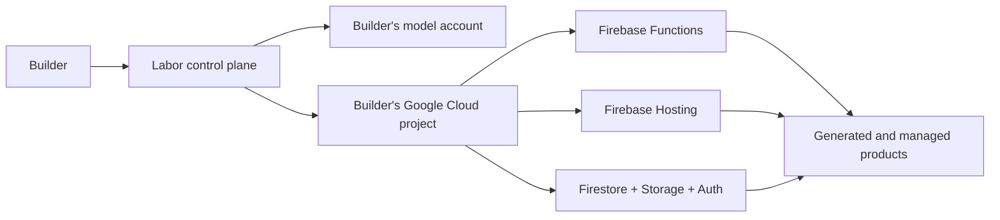

<p align="center">
  <a href="https://uselabor.com">
    
  </a>
</p>

<h1 align="center">Labor</h1>

<p align="center"><strong>Build, deploy, and manage your product.</strong></p>

<p align="center">
  Labor is a free, open-source AI system that turns your ideas into working products using your model and your cloud.
</p>

<p align="center">
  <a href="https://uselabor.com"><strong>Try the free hosted version at uselabor.com</strong></a>
</p>

<p align="center">
  <a href="https://uselabor.com"></a>
  <a href="LICENSE"></a>
  <a href="docs/FOREVER_FREE.md"></a>
  <a href="https://github.com/hribab/labor/issues"></a>
  <a href="https://github.com/hribab/labor/discussions"></a>
</p>

<p align="center">
  <a href="https://uselabor.com">Use Labor</a> &middot;
  <a href="docs/FOREVER_FREE.md">Forever Free Pledge</a> &middot;
  <a href="CONTRIBUTING.md">Contribute</a> &middot;
  <a href="https://github.com/hribab/labor/discussions">Discuss</a> &middot;
  <a href="SECURITY.md">Security</a>
</p>

---

## Why Labor exists

Building software is getting easier. Getting it into people's hands still takes work: deployment, releases, reaching users, listening to feedback, and deciding what to improve.

Labor connects your model to your cloud and helps carry your idea through that work. It builds the product, puts it online, prepares launch material to help you reach users, and manages updates after release.

## The Forever Free Pledge

Labor has no subscription, premium tier, or paid feature gates. The official project will not hide advanced capabilities behind payment. Every official Labor feature belongs in this public repository and remains available to everyone.

That promise is about **Labor itself**. The OpenAI and Google Cloud accounts you connect may charge for model tokens, builds, storage, hosting, bandwidth, or other usage. Those providers bill you directly; Labor does not add a markup.

Read the full [Forever Free Pledge](docs/FOREVER_FREE.md).

## What Labor does

At its core, Labor connects your model and your cloud so an idea becomes a product other people can use. You can also connect your own domain.

```text
IDEA -> CODE -> CLOUD -> RELEASE -> MANAGE
```

- **Generates the product:** one complete first version from the complete product intent.
- **Deploys into your cloud:** Firebase Hosting, Functions, Authentication, Firestore, Storage, and Analytics live in the Google Cloud project you choose.
- **Releases it:** Labor creates launch material, SEO pages, Analytics integration, and production releases.
- **Keeps working:** it can inspect outcomes, propose features, update the product, and manage future releases.
- **Finds ideas:** Agent can generate and launch a batch; Evolver searches through mutation, pressure, selection, and memory.

## Single Shot Product Generation

Give Labor the whole product you want to build. It asks the model for a complete first version in one generation, including the frontend, backend, and the connections between them.

This follows a simple assumption: as models improve, they can handle more of a product in a single call. Giving the model the full product intent can save time and tokens by reducing repeated instructions and keeping related parts of the system together.

Labor then validates the result, repairs problems when needed, builds it, and deploys it.

## Evolver: finding software worth building

Labor also helps when you do not have an idea yet. **Evolver** is a new kind of autonomous software designed to change across generations. Labor uses it to search for software worth building.

You give Evolver a starting direction. In Labor, that direction is `0 -> 1`: find software worth building. It creates structured idea blueprints called genomes, mutates and combines them, tests the resulting ideas, and keeps diverse survivors. It remembers what survived and what failed, then uses that history to change how it searches next time.

```text
OBSERVE -> REMEMBER -> BREED -> ATTACK -> SELECT -> EVOLVE
```

Labor can take the surviving ideas through code generation, deployment, release, and ongoing management.

## Your model. Your cloud. Your product.

Labor uses a small control plane for sign-in and onboarding. After you connect a Google Cloud project, product generation, source archives, Functions, databases, files, Hosting, releases, and product analytics run in the project you selected.



Existing physical identifiers such as `testkitchen` data paths and the `forwardrun` generated-function codebase remain as compatibility infrastructure. They are not product branding and do not move generated applications back into Labor's control project.

## Current status

Labor is experimental software with real cloud permissions and real provider costs. Autonomous runs can consume a meaningful token budget, create infrastructure, and still fail to produce a useful product. Use a dedicated Google Cloud project, set billing alerts, review scopes, and start small.

The public application is [uselabor.com](https://uselabor.com).

## Quick start

### Requirements

- Node.js 22
- pnpm
- Firebase CLI
- A Firebase/Google Cloud project for the Labor control plane
- A Google OAuth web application
- An OpenAI API key

### 1. Clone and install

```bash
git clone https://github.com/hribab/labor.git
cd labor
pnpm install
```

### 2. Create local configuration

```bash
cp .env.example .env.local
cp .firebaserc.example .firebaserc
cp functions/.env.example functions/.env.your-firebase-project-id
```

Replace every placeholder with the Firebase web-app configuration and project IDs from your own Firebase project. Local environment files, `.firebaserc`, service-account files, private keys, deployment state, and build output are ignored by Git.

Never commit model API keys, OAuth client secrets, service-account JSON, refresh tokens, or private keys. Firebase browser configuration is visible to every browser at runtime; protect the project with Firebase Security Rules, IAM, App Check where appropriate, API restrictions, quotas, and billing alerts.

### 3. Select your Firebase project

```bash
firebase login
firebase use --add
```

Configure your OAuth consent screen and authorized domains for the hostnames you use. Labor requests Google Cloud and Analytics scopes only when a user explicitly connects their cloud.

### 4. Run the frontend

```bash
pnpm run dev
```

### 5. Verify changes

```bash
pnpm run check
```

### 6. Deploy your instance

```bash
firebase deploy --only functions
firebase deploy --only hosting
```

Hosting runs `pnpm run build` through the configured predeploy hook.

## Repository map

```text
src/                              React application and product UI
src/components/                   Shared product, release, login, and legal UI
src/pages/                        Agent, Evolver, Settings, onboarding, and legal pages
functions/index.js                Labor control and customer-runtime Functions
functions/googleCloudProvisioning.js
                                  Customer-cloud setup and deployment
functions/laborEvolution.js       Evolution engine
functions/laborAdHoc.js           Single-call idea generation
public/                           Brand, social, manifest, robots, and sitemap assets
docs/FOREVER_FREE.md              The project promise
```

## Contributing

Labor should become more useful because builders can see it, question it, and improve it together.

- Use [GitHub Discussions](https://github.com/hribab/labor/discussions) for ideas, architecture questions, experiments, and proposals.
- Use [GitHub Issues](https://github.com/hribab/labor/issues) for reproducible bugs and accepted work.
- Read [CONTRIBUTING.md](CONTRIBUTING.md) before opening a pull request.
- Read [SECURITY.md](SECURITY.md) before reporting a vulnerability. Never place credentials or private customer data in a public issue.

## License

Labor is licensed under the [GNU Affero General Public License v3.0](LICENSE). If you run a modified version for users over a network, the AGPL requires you to offer those users the corresponding source for that version.

The [Forever Free Pledge](docs/FOREVER_FREE.md) is the official project's governance promise. It does not add a field-of-use or non-commercial restriction to the AGPL.

---

<p align="center"><strong>The future belongs to people who keep building.</strong></p>
<p align="center">Labor gives you leverage. Your courage gives it direction.</p>
