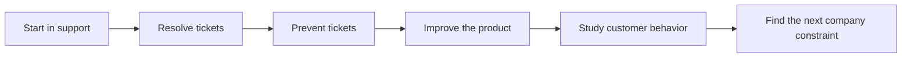
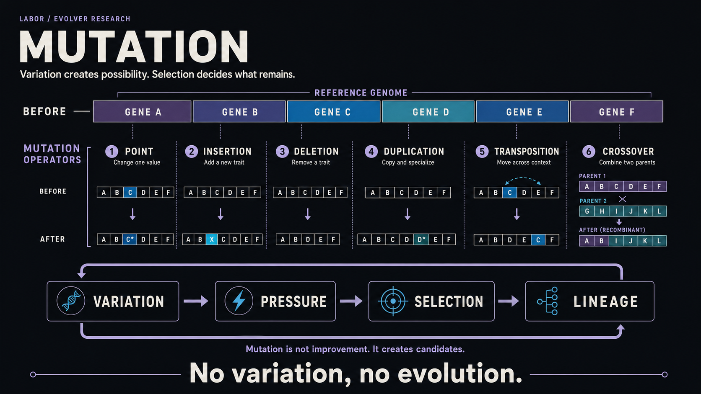
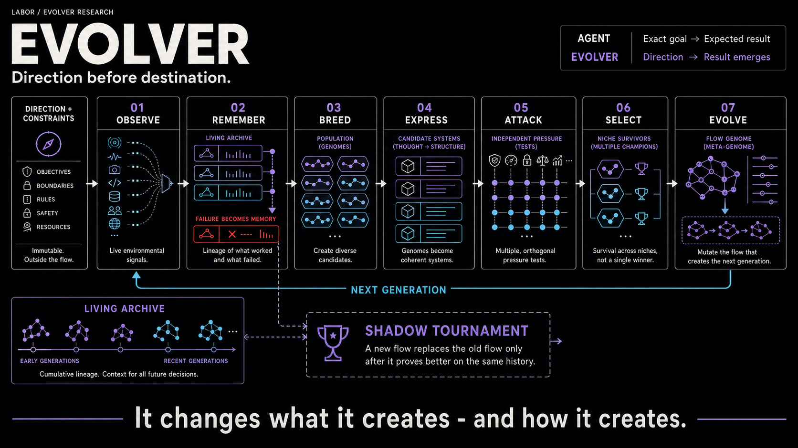
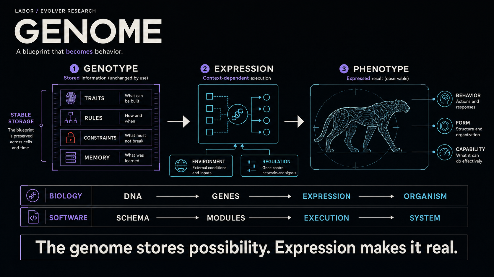
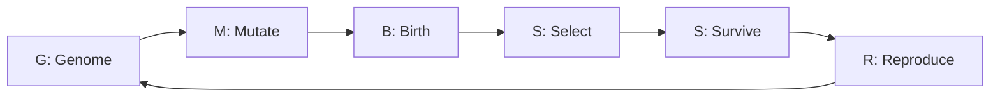
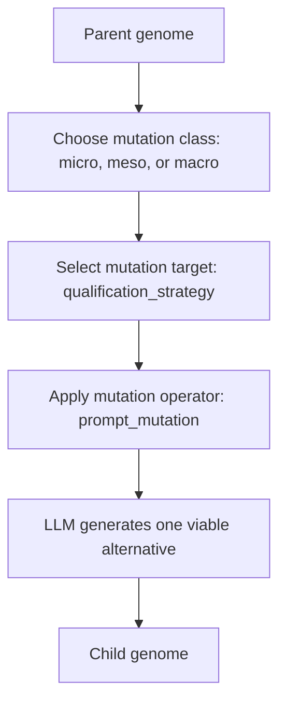
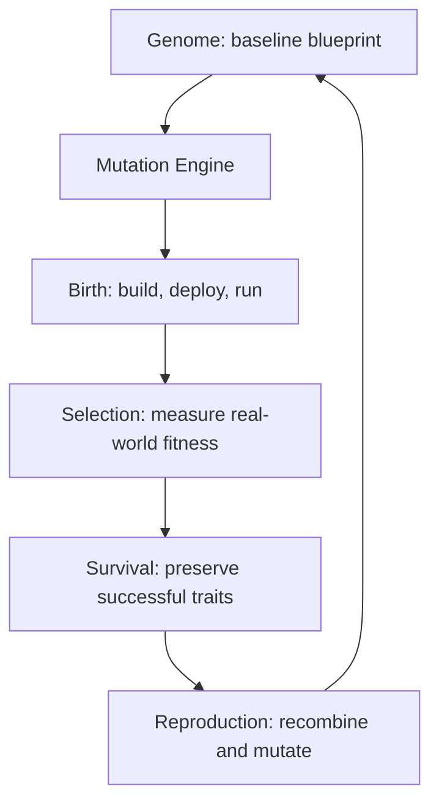
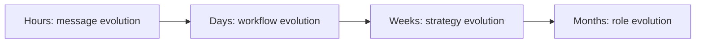
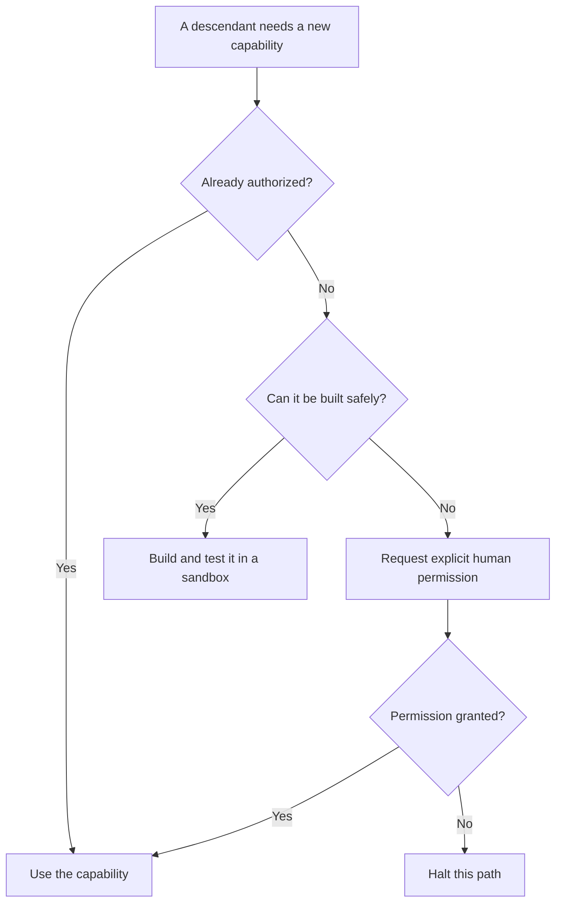

<p align="center">
  <a href="https://uselabor.com">
    
  </a>
</p>

<h1 align="center">Evolver</h1>

<p align="center"><strong>Direction, not a destination.</strong></p>

<p align="center">
  A new kind of autonomous software that changes across generations.
</p>

<p align="center">
  <a href="./Evolver.pdf">Read the research paper</a> &middot;
  <a href="https://github.com/hribab/labor/blob/main/functions/laborEvolution.js">See Labor's implementation</a> &middot;
  <a href="https://github.com/hribab/labor/discussions">Join the discussion</a>
</p>

---

## Contents

- [The goal is the boundary](#the-goal-is-the-boundary)
- [Direction, not a destination](#direction-not-a-destination)
- [How software can evolve](#how-software-can-evolve)
- [The evolutionary sequence](#the-evolutionary-sequence)
- [A Sales Evolver](#a-sales-evolver)
- [Mutation](#mutation)
- [Should evidence influence mutation?](#should-evidence-influence-mutation)
- [Birth, selection, survival, and reproduction](#birth-selection-survival-and-reproduction)
- [Generations and evolutionary clocks](#generations-and-evolutionary-clocks)
- [Skills and access](#skills-and-access)
- [Final point](#final-point)

## The goal is the boundary

We build agents to achieve something autonomously. For example, take a support agent. A ticket gets filed in ServiceNow. The agent wakes up, reads the ticket, checks previous tickets, looks at its skills, memory, and data access, and calls an LLM. It may use a few tools, make decisions, use multi-step planning or multi-agent orchestration, and try to resolve the issue.

While doing this, it may make many decisions without asking a human. Why is it making those decisions? Because it needs to achieve a goal. That is the important part. Every agent has a predefined goal. Everything it does is to achieve that goal.

> **The goal is its boundary.**

A support agent solves support tickets today. Tomorrow, it solves support tickets. Next year, give it a model 100 times more capable, better memory, more tools, and unlimited compute. It still solves support tickets. It uses all of its intelligence to navigate and solve support tickets. It becomes a frighteningly good support agent.

This is close to the point behind Nick Bostrom's orthogonality thesis: intelligence and final goals are separate things. A system can become extremely intelligent without suddenly deciding that its original goal is stupid. It is like Nikola Tesla digging street trenches for Edison's DC cables and being stuck there for life.

Can this agent ask fundamental questions like these?

- Why is it fixing these tickets at all?
- What is the current situation of the company?
- Is this even the right thing to do?
- How much intelligence is available?
- How much can it achieve with that intelligence?

The agent may be intelligent enough to question the task, but most agents are neither designed nor authorized to revise their own role. Their objective is fixed outside the model.

> **Stop building AI agents that act like Nick Bostrom's Paperclip Maximizer: rigid, hyper-repetitive optimizers that turn surprisingly stupid the second context shifts.**

## Direction, not a destination

What I mean by Evolver here is a different kind of software. We do not start building it with a goal in mind; we start with a simple direction and let it evolve like natural humans do.

For example, start in support. The first generation resolves tickets. Later generations may prevent tickets, improve the product, or discover that a different company bottleneck matters more.



Frankly, human evolution happened this way too. Nobody knows exactly where we are heading.

You might ask: why do we even give an Evolver the first direction? Why can it not choose its own starting point?

Without a starting direction, the search space is too large to explore efficiently. The direction constrains the first generation without permanently fixing later generations.

| Agent | Evolver |
| --- | --- |
| Begins with an exact goal | Begins with a direction |
| Finds a route to an expected result | Creates and tests possible descendants |
| Better intelligence improves execution | Evidence can change what later generations become |
| The destination exists before the work begins | The destination emerges through variation and survival |

## How software can evolve

The important question is: how can we make software actually evolve?

The best approach I can think of is to mirror the process behind biological evolution: the journey from early hominins to Homo sapiens over 6.7 million years. To keep this practical rather than purely philosophical, we can look directly at how human cells actually work, mutate, and adapt.

Your DNA gets copied constantly when cells divide. Most of the time, copying works extremely well. But not perfectly. A very simplified flow looks like this:

```text
DNA
  -> something changes it
  -> repair machinery may fix it
  -> some changes survive
  -> the organism develops
  -> the environment tests the result
  -> selection happens
```

Nobody sits inside the cell saying, "We need stronger legs. Please mutate the leg gene." There is no product manager for DNA. Mutation happens. Then reality decides whether that change matters.

> **Mutation proposes changes. Selection decides which changes survive.**

### What causes mutations?

Many things. Some come from inside the body. DNA copying errors happen. Normal chemical reactions happen. Reactive molecules can damage DNA.

Some come from outside: UV radiation, radiation, certain chemicals, and toxins. Biology also has repair machinery trying to fix damage constantly. Most mistakes disappear. Some remain.

There is an important distinction between two kinds of mutations:

| Mutation | What it means |
| --- | --- |
| **Germline mutation** | Occurs in the sperm or egg lineage. It passes directly to the next generation: sperm or egg lineage -> child -> evolutionary lineage. |
| **Somatic mutation** | Occurs in body cells such as the skin, liver, brain, or lungs. It affects that specific body, but it is not passed down to offspring. |

Mutation is not one thing. At the genome level, changes occur by substituting a single letter, inserting or deleting letters, duplicating a region, inverting a region, moving a region, recombining regions, or occasionally making a massive structural change.

<p align="center">
  
</p>

If you notice something, evolution does not redesign the genome from scratch every generation. Most inherited information is preserved while a smaller amount varies.

If we map this to software, it would look like this:

1. Define a starting blueprint: the genome.
2. Introduce mutations: variations to the genome.
3. Build the mutated genome and release it into the real world.
4. Save what survives using real evidence.
5. Create new offspring from the surviving mutations.
6. Repeat.

<p align="center">
  
</p>

## The evolutionary sequence

A software "genome" is not complex chemistry. It is simply a set of key-value pairs defining the system's DNA: Goal, Role, Strategy, Prompts, Tools, Models, Policies, Pricing, Workflows, Metrics, and more, unless you are intentionally building an ultra-complex, open-ended evolutionary ecosystem.

<p align="center">
  
</p>

Here is the exact sequence:

```text
G -> M -> B -> S -> S -> R -> repeat

G  Genome
M  Mutate
B  Birth
S  Select
S  Survive
R  Reproduce
```

Yes, I know "birth" sounds dramatic. It just means we actually run the new variant.



## A Sales Evolver

For example, let us build a Sales Evolver.

The initial genome serves as the parent blueprint for all subsequent mutations.

### Mutable genome

```yaml
current_role: Sales
customer: CTOs at Series B companies
channel: Cold email
strategy: Outbound
pricing: $5,000/month
tools:
  - CRM
  - Email
  - Analytics
follow_up: 3 days
```

### Immutable envelope

```yaml
security_policy:
  - SOC 2
  - No API keys exposed
legal_constraints:
  - CAN-SPAM
  - GDPR
  - CCPA
permission_limits: Read-only access to the CRM customer database
spending_limits: $3,000 maximum LLM spend
approval_gates: Human sign-off required for anything over $10,000
shutdown_controls: Self-terminate if it determines that stopping is better
```

The mutable genome defines what may evolve. The immutable envelope defines what evolution may never silently cross.

## Mutation

This is probably the most important part. Do not just ask an LLM, "Create 1,000 random versions of this." You will get noise. And if you change 1,000 things at once and one version works better, which mutation caused the improvement? No idea.

Biology is much more conservative. Human evolution took millions of years. Most DNA gets copied. Small amounts change. We should steal that idea.

### Three mutation scales

I like dividing software mutations into three levels: micro, meso, and macro.

#### Micro mutations

These are small changes because we are not trying to kill the creature every generation. We are trying to explore around something that already works.

For a Sales Evolver, most micro mutations should probably look like changing email wording, subject line, follow-up timing, lead score threshold, model temperature, prompt instruction, tool parameter, or call sequence.

#### Meso mutations

These are bigger changes. We do these because we need to escape local maxima before micro mutations hit diminishing returns. Micro mutations make you the absolute best at your current hill, but meso mutations help you find a taller mountain.

For a Sales Evolver, meso mutations could shift from email to LinkedIn outreach, outbound to inbound, generic prospecting to account-based sales, fixed pricing to usage pricing, or CRM workflow A to CRM workflow B.

#### Macro mutations

Now we get into the dangerous stuff. Macro mutations can change what the creature is.

For a Sales Evolver, this could mean shifting from a sales function to a product-led growth system. Eventually, it could evolve from sales to growth, business operations, and finally a CEO-like phenotype.

A reasonable first implementation might begin with **80% micro, 18% meso, and 2% macro exploration**. These are starting priors, not universal constants, and they should change as evidence accumulates.

Why is macro so low? Because macro mutations can destroy accumulated competence. Imagine a Sales Evolver that spent six months becoming unbelievably good at something. Then, one beautiful Tuesday morning, it decides, "I have decided I am now an HR system." Wonderful. Evolution over.

Radical mutation should exist. It should just be rare.

| Scale | Typical change | Starting prior | Purpose |
| --- | --- | ---: | --- |
| **Micro** | Wording, timing, thresholds, prompts, tool parameters | 80% | Explore around something that already works |
| **Meso** | Channels, pricing, workflows, strategy | 18% | Escape a local maximum |
| **Macro** | Role, domain, or system architecture | 2% | Discover a fundamentally different phenotype |

### Mutation load

How many mutations should one offspring get?

You should never use a fixed number blindly. What actually matters is **mutation load**, which is the proportion of the existing genome modified at any given time.

Maybe an offspring should receive:

- 1-3 micro mutations, or
- 1 meso mutation, or
- very rarely, 1 macro mutation.

You must avoid altering dozens of parameters simultaneously. If you change 100 unrelated parameters at once and performance shifts, you lose causal visibility. You will not know which mutation drove the lift and which ones dragged it down.

### One generation of children

Take Parent #42:

```text
Parent #42
|
|-- Child 1: mutate subject line
|-- Child 2: mutate email body
|-- Child 3: mutate follow-up 3d -> 1d
|-- Child 4: mutate target CTO -> VP Engineering
|-- Child 5: mutate qualification threshold
|-- Child 6: mutate email personalization method
|-- Child 7: mutate pricing presentation
|-- Child 8: add LinkedIn before email
|-- Child 9: recombine targeting from another winner
|-- Child 10: duplicate successful follow-up sequence
|-- Child 11: bigger mutation, outbound -> partnership channel
`-- Child 12: unchanged control
```

### The unchanged control

That final variant, the unchanged control, is also important. Sometimes an offspring performs better not because its mutation made it smarter, but because external market dynamics shifted in its favor.

Running an unmutated control in parallel provides a true baseline. Without it, you end up giving a mutation credit for what was actually just a lucky change in the weather.

### Who decides which mutation happens?

This is another place where I think we should be careful. Do not make the LLM itself equal to evolution. The LLM is only one part of the process.

Instead of letting an LLM run wild, build a dedicated **Mutation Engine** that executes against a deterministic catalog of mutation operators:

| Operator | Purpose |
| --- | --- |
| `point_mutation()` / `parameter_mutation()` / `prompt_mutation()` | Precise tweaks to isolated instructions, thresholds, or text blocks. |
| `tool_mutation()` / `workflow_mutation()` | Swap, add, or reorder tools and procedural steps. |
| `duplication()` / `deletion()` | Double down on successful subroutines or prune dead weight. |
| `recombination()` | Merge high-performing traits from two distinct winning genomes. |
| `strategy_mutation()` / `role_mutation()` | Make high-order shifts that redefine system positioning or domain responsibilities. |

This establishes a disciplined execution pipeline for every new variant:



The main difference is that we are not asking the LLM, "What is the best way to grow this company?" Instead, the system dictates: "We have chosen to mutate `qualification_strategy`. Produce exactly one viable alternative."

The LLM does not run the strategy. It merely proposes a discrete variation. The real world determines whether that variation deserves to survive.

## Should evidence influence mutation?

In pure biological evolution, mutation is blind. DNA does not read a sales dashboard, notice that conversion is down, and consciously decide to mutate its pricing strategy. Organisms do not intelligently select the exact mutation they need.

There is immense value in keeping mutation independent from the fitness function. If you tie them together too tightly, your Evolver degrades back into just another standard optimization agent.

But software allows us to bend the rules of biology. Imagine your metrics show excellent reply rates and meeting bookings, but terrible closed-won conversions. A smart Mutation Engine can recognize this weakness and intentionally increase the probability of mutations around pricing, demo scripts, qualification questions, or offers.

To balance these two philosophies, a strong architecture uses a hybrid approach.

### A starting exploration split

| Exploration | Starting allocation | Meaning |
| --- | ---: | --- |
| **Directed exploration** | 70% | Evidence tells the engine roughly where to focus its experiments. |
| **Open exploration** | 30% | The engine mutates parameters in unexpected places. |

Why keep 30% open exploration? Because if you only mutate where you think the problem exists, you restrict the system entirely to your current model of the world. You limit the Evolver to the problems you can imagine, completely missing the systemic breakthroughs you could not predict.

These percentages are a starting split, not a permanent law.

### Dynamic mutation rates

The mutation rate itself should not be static. It should adapt dynamically based on the system's overall fitness trend:

| Current state | Mutation response |
| --- | --- |
| **Rapidly improving** | Small, rare mutations |
| **Stable** | Normal baseline mutation load |
| **Stagnating** | Increased exploration rate |
| **Failing badly** | Occasional radical macro mutations |

If a genome is currently crushing its goals, stop touching its DNA. Conversely, if metrics have flatlined for six months, mutating an email subject line for the 14,000th time is not going to save the system.

## Birth, selection, survival, and reproduction

### B: Birth (build and release)

Once a mutation is generated, you have to actually build it. Run it. Deploy it. You must give the system a rich enough environment to actually behave and execute its instructions.

This distinction is critical: an abstract idea sitting in an LLM response is not an organism. A proposed workflow resting statically inside a JSON configuration file is not an organism.

For evolution to occur, the system must collide with reality. It has to send the emails, make the API calls, and interact with the market.

That transition from static blueprint to active execution is what we call birth. Yes, I know it is a weird word to use for software deployment. Moving on.

### S: Selection - when reality gets a vote

Now reality gets a vote, and you must measure fitness.

For a Sales Evolver, this means tracking real-world metrics such as revenue, margin, customer acquisition cost (CAC), retention, customer satisfaction, conversion rates, and long-term company value.

This step is notoriously difficult because the fitness function quietly determines exactly what kind of Evolver you get.

- If your fitness function simply maximizes emails sent, congratulations: you evolved a spam bot.
- If the goal maximizes meetings booked, you build a machine that aggressively fills calendars with terrible prospects.
- If you only maximize this month's revenue, it may use tactics that completely destroy six-month retention.

To prevent this, fitness must be a composite score. It might look something like this:

```text
30% revenue growth
+ 25% retention
+ 20% margin
+ 15% customer satisfaction
+ 10% long-term strategic value
```

The exact percentages are not the point. The point is that the fitness function acts as the invisible hand of the system, deciding exactly which behaviors get amplified and which die off.

### The secret to radical evolution

If you want the Evolver to become truly wild, look closely at how you define fitness. The deepest trick of this system is not the mutation rate. It is the fitness function.

Suppose your ultimate fitness goal is simply to maximize sales. No matter how many generations pass or how much the genome mutates, you are strictly building a Sales Evolver. It might become a very strange, highly effective one, but it remains trapped inside the sales domain.

Now imagine a broader fitness function: **increase durable company value**, combined with a starting direction to simply begin in sales.

That creates a completely different architecture:

| Generation | Possible change |
| ---: | --- |
| 1 | Optimize cold outreach |
| 10 | Pivot to pricing models |
| 30 | Discover that retention matters more than new acquisition |
| 50 | Overhaul onboarding |
| 80 | Start altering the core product |
| 120 | Conclude that engineering, not sales, is the actual constraint |

Notice what happened:

```text
Sales -> Revenue -> Growth -> Product -> Resource Allocation -> Company Strategy
```

It evolved a CEO-like phenotype. Nobody ever wrote the instruction: "At Generation 120, become the CEO." That is the ultimate point of evolutionary selection.

### S: Survival

Once the fitness test is complete, reality has spoken. Some children will outperform the baseline, and some will perform worse.

You keep what survives, but crucially, you do not just keep the final business output. You must preserve the underlying genetic traits that drove that success.

Instead of treating each surviving child as a simple pass or fail, evaluate its specific parts:

- Child A might have evolved highly effective targeting.
- Child B might have discovered a superior pricing model.
- Child C might have generated a terrible overall workflow and failed the overall fitness test, but stumbled upon a surprisingly lucrative new customer segment.

You do not have to discard Child C entirely. You can extract that specific winning trait while discarding the rest of its genome. This granular trait selection is where inheritance gets interesting and sets up the final stage of the loop.

### R: Reproduction

The final step is reproduction. Take the winners from the survival phase, copy their most successful traits, and recombine them to form the foundation of the next generation before introducing new mutations.

For example, if Parent A developed highly effective targeting and Parent B discovered a superior pricing model, do not keep them isolated. Merge them.

The resulting offspring, Child C, inherits A's targeting and B's pricing, then receives one new mutation of its own to continue pushing the boundary. Once that genome is formed, the entire evolutionary loop repeats.

## The complete Sales Evolver pipeline

When you pull all these pieces together, the full Sales Evolver operates as a strict, repeatable pipeline.

1. **Genome:** Read the baseline blueprint.
2. **Mutation:** Choose the mutation rate and scale, target a specific parameter, apply an operator, and generate a new variant.
3. **Birth:** Build, deploy, and run the variant in a live environment.
4. **Selection:** Let reality cast its vote through measured fitness.
5. **Survival:** Identify and preserve the specific genetic traits that succeeded.
6. **Reproduction:** Combine inherited winning traits with a new round of mutations to create the next generation.



## Generations and evolutionary clocks

### What is a generation?

In biology, defining a generation is simple: parents reproduce to create children, establishing a clear chronological boundary.

Software does not naturally possess this rhythm, so we have to manufacture it. This requires wrapping the core Evolver in an overarching control system: an **Evolution Engine**.

Think of this engine as the system's pacemaker. It constantly cycles through these steps: reading the current genome and its performance, generating mutations, creating and deploying offspring, measuring fitness, selecting winners, copying winning traits, mutating them again, and kicking off the next generation.

### When should a generation end?

The most critical architectural question is deciding exactly when one generation ends and the next begins.

Do not define this boundary naively. If you rigidly declare that a generation ends only after "100 completed sales opportunities," you introduce a fatal flaw. If the current genome is terrible and never reaches 100 opportunities, the system stalls indefinitely. You have successfully invented an Evolver that never evolves.

To prevent this trap, a generation should close whenever the first of several conditions is met:

- A sufficient volume of interactions has occurred.
- Enough distinct outcomes have been observed.
- Statistical confidence in the variant has been reached.
- A maximum time window expires.

### Failure is data

If an offspring runs for 30 days and yields zero replies, zero meetings, and zero revenue, do not conclude that evolution must pause because "nothing happened."

Something did happen: the phenotype failed completely. That is incredibly strong fitness information. A total lack of traction does not mean you stop evolving. A stagnant baseline is exactly what should trigger the engine's largest macro mutations.

Before broadening the mutation radius, rule out broken instrumentation, poor deliverability, insufficient exposure, tool failure, and environmental changes.

### Several concurrent evolutionary clocks

Another architectural mistake is forcing the entire system onto a single generation clock. Different components demand different time horizons to prove their fitness.

| Evolutionary clock | Example changes | Typical evidence horizon |
| --- | --- | --- |
| **Message** | Subject lines, email copy, follow-up timing | Hours |
| **Workflow** | Tool order, qualification flow, handoffs | Days |
| **Strategy** | Channels, pricing, customer segments | Weeks |
| **Role** | Product direction or company responsibility | Months |

This nested timing structure ensures that fast tactical experiments do not artificially rush the timeline needed to validate deep strategic pivots.



## Skills and access

### The problem of skills and access

Suppose a Sales Evolver correctly identifies that its high closed-lost rate is not an outreach problem, but a friction problem in the self-serve checkout process.

Its evolutionary imperative is to modify the pricing tiers or streamline the onboarding flow rather than just sending more cold emails. That is exactly the behavior we want. But it hits a wall: it does not have access to the billing platform or the frontend codebase. Now what?

The organism must be architected to recognize its own operational limitations. It needs the capacity to analyze its environment and declare, "I need a new skill."

Whether the missing piece is access to the payment gateway, marketing analytics, the content management system, or backend CRM architecture, the Evolver must intelligently navigate the roadblock:

1. If it is authorized to request the necessary API keys or permissions programmatically, it should request them.
2. If it can safely script or build the missing capability itself, it should build it.
3. If it reaches a hard security boundary, it must halt and ask a human for explicit permission.



### Dynamic tooling

This is another major departure from traditional software design. You do not pre-provision every tool or API the Evolver will ever need. You cannot, because you do not know what it will ultimately become.

As the system mutates from a simple outbound messaging engine into a comprehensive revenue and growth machine, its future phenotype will inevitably require capabilities, integrations, and access levels that its original creator never imagined.

## Final point

Do not build only agents. Build Evolvers.

Agents are goal-seeking intelligent systems, similar to highly capable factory machines. Evolvers are evolving intelligent systems whose descendants can change across generations, with the fittest variants surviving.

> **An agent becomes better at reaching a destination. An Evolver discovers what the next destination can be.**

---

Read the formal architecture, limitations, and three application studies in the [Evolver research paper](./Evolver.pdf).
